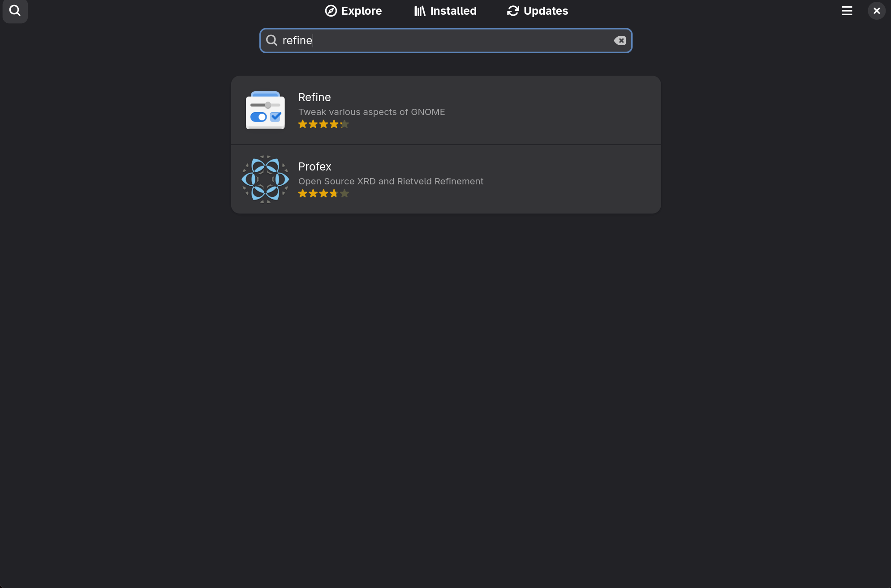
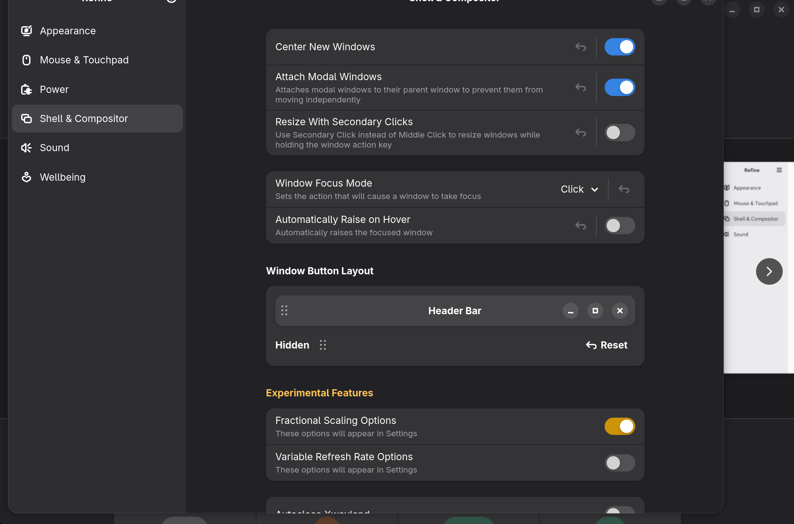

# Refine

Refine es la alternativa moderna a GNOME Tweaks en Fedora 43+. Permite ajustar aspectos de GNOME que no están expuestos en la configuración estándar, como los botones de ventana, el escalado fraccional y el comportamiento del compositor.

## Instalación

Busca **Refine** en la Software Store de Fedora e instálalo desde ahí:

## Habilitar botones de maximizar y minimizar

Por defecto GNOME solo muestra el botón de cerrar. Para recuperar los botones de maximizar y minimizar:

1. Abre Refine
2. Ve a **Shell & Compositor**
3. En **Window Button Layout**, activa los botones deseados desde la sección **Header Bar**

---

[← Volver al README](../README.md)
